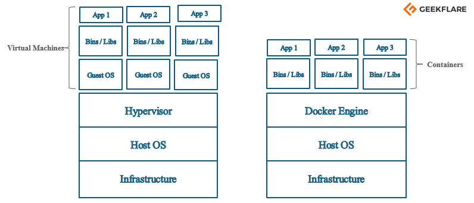

#  L'orchestration et la conteneurisation démystifiés

A travers mon expérience professionnelle et mon cursus pédgogique, j'ai été ammené à travailler avec de nombreuses technologies diverses et variées. L'apprentissage des technologies d'orchestration a constitué l'essentiel de ma dernière année de formation d'expert en systèmes d'information.

Avec la pratique de différentes technologies d'orchestration, tel que `Kubernetes`, j'ai pu constater que l'orchestration et la conteneurisation sont deux concepts qui vont de pair. Mais **est-ce la même chose?**

## C'est quoi l'orchestration?

Commençons par poser les bases : qu'est-ce que l'orchestration?

Prenons le cas d'une application. Traditionellement, toutes les étapes du cycle de vie de cette application étaient réalisées manuellement : le **déploiement**, la **mise à jour**, la **mise à l'échelle**... Toutes ces étapes prenaient un certain temps à réaliser, demandaient des compétences spécifiques et lorsque les choses ne se passaient pas comme prévu, il fallait relancer l'application ou la stack d'applications manuellement. Aujourd'hui, on privilégie **l'orchestration** pour réaliser ces tâches de manière automatisée.

Pour reprendre la définition de `Red Hat`, l'orchestration "correspond à la configuration, la gestion et la coordination automatisée d'un système informatique, d'applications ou de services". Concrètement, l'orchestration sert à gérer de façon automatisée **tout un processus ou tout un workflow**. Ainsi, on obtient un gain de temps considérable dans le déploiement et le maintien de ce processus.

Aujourd'hui, il existe de nombreuses technologies qui sont considérées comme des orchestrateurs. Parmis les plus connues, nous pouvons citer :

- **Kubernetes** - Système open-source permettant d'automatiser le déploiement, la mise à l'échelle et la gestion d'applications conteneurisées
- **OpenShift**- Plateforme unifiée qui permet de créer, de moderniser et de déployer des applications à grande échelle
- **Docker Compose** - Modèle d'orchestration de Docker permettant de définir et d'exécuter des applications multi-conteneurs qui fonctionnent ensemble

> **Note**  
> Bien que Docker Compose permette d'orchestrer des conteneurs, il ne convient pas à des déploiements à grande échelle.

Si vous prêtez attention à ces technologies, vous vous rendrez très vite compte qu'elles utilisent toutes à un moment ou a un autre de la **conteneurisation**. Mais de quoi parle-t-on?

## C'est quoi la conteneurisation?

Pour reprendre la définition de `Red Hat`, "la conteneurisation consiste à rassembler le code d'un logiciel et tous ses composants de manière à les isoler dans leur propre « **conteneur** »".

Pour expliquer la conteneurisation de façon simple, on peut prendre l'exemple d'une pizza. Supposons que vous vouliez en manger une. Deux solutions s'offrent à vous :

- **Faire la pizza vous-même**, ce qui prend du temps, requiert des outils (ex : four), des ingrédients et du savoir-faire
- **Commander cette pizza**, ce qui peut s'avérer plus simple et bien plus rapide car vous n'auriez plus besoin de ce que nous avons cité précédemment

Sauf si vous êtes un cuisinier hors pair, vous privilégierez la seconde option car vous n'aurez pas à tout faire vous-même (en plus, c'est pas trop chère 😝). De la même manière, un une application dans son conteneur est comme une pizza dans sa boîte :

- Il est **portable** et peut s'exécuter sur n'importe quel environnement, comme on peut manger une pizza n'importe où
- Il est **isolé**, tout comme la boîte à pizza isole les pizzas entre elles, les applications sont isolées les unes des autres
- Il est **prêt à l'emploi** et embarque tous les composants nécessaires à son bon fonctionnement, comme une pizza qui ne demande qu'à être dégustée


Ainsi, dans le cas de la conteneurisation, nous obtiendrions le schéma suivant :


Techniquement parlant, un conteneur **se rapproche du concept de machines virtuelles**, sans pour autant en être une. Contrairement à une machine virtuelle qui embarque son propre système d'exploitation, un conteneur **n'embarque pas l'entièreté de son système d'exploitation**. En revanche, il s'appuie sur **le noyau de son hôte** et utilise donc une partie de l'OS de son hôte pour fonctionner, ce qui a pour effet de rendre un conteneur beaucoup plus léger qu'une machine virtuelle :



> **Crédits** : Geekflare

C'est d'ailleurs pour cette raison que nous retrouvons des conteneurs compatibles **Linux** et des conteneurs compatibles **Windows**.

### Pourquoi deux types de conteneurs?

Sans trop rentrer dans les détails, Windows et Linux sont **deux OS fondamentalement différents**. Cela se voit dans la manière d'exécuter des programmes (`.exe` sous Windows, non comptaible sous Linux), ou rien qu'au niveau de l'arborescence des deux OS :

```txt
# Windows
C:\ # Racine
  ├── 📁 Program Files\
  ├── 📁 Program Files (x86)\
  ├── 📁 Users\
  ├── 📁 Windows\
  │ ├── 📁 System32\
  │ ├── ...
  ├── ...

# Linux
/ # Racine
  ├── 📁 boot/
  ├── 📁 dev/
  ├── 📁 etc/
  ├── 📁 home/
  ├── ...
```

Puisque les conteneurs prennent appuie sur le noyau de leur hôte, **les images produites ne peuvent techniquement pas tourner de la même façon** sur un environnement Windows ou sur un environnement Linux.

> **Note**  
> Il est cependant possible avec **Docker Windows** d'émuler un environnement Linux, permettant de builder des images compatibles Linux.

## Au final, orchestration == conteneurisation?

Spoiler : non.

La frontière entre l'orchestration et la conteneurisation est fine, et il est donc facile de confondre les deux termes. Cependant, nous parlons bien de deux termes différents qui n'ont ainsi **pas la même finalité**.

Comme nous l'avons vu, l'orchestartion est axée sur **la gestion automatisée des ressources** tandis que la conteneurisation est axée sur **une utilisation efficiente des ressources** de manière à embarquer une application et ses dépendances dans une image légère.

Techniquement parlant, **les deux processus vont très bien ensemble** : orchestrer des ressources efficientes de base permet **un gain certain en matière de performances et d'utilisation des ressources**. C'est en grande partie pourquoi l'orchestration est souvent utilisée avec de la conteneurisation, et pourquoi on a tendance à ne pas les dissocier.

Ainsi, il est important de noter l'existence de technologies d'orchestration **qui ne dépendant pas de la conteneurisation**. Parmis ces dernières, nous avons :

- `IaC` **Ansible** - Configure et gère un parc informatique à toute échelle
- `IaC` **Terraform** - Permet le provisionnement de ressources dans une multitude de clouds

> `IaC` : Infrastructure as Code, gestion d'une infrastructure par des fichiers

## Quels cas d'usage donc?

Maintenant que nous avons dissociés l'orchestration de la conteneurisation, nous pouvons nous interroger sur leur utilité au sein d'un SI. Dans quels cas utiliser distinctement ces technologies?

### Orchestration

L'orchestration est privilégiée dans de nombreux cas. Nous pouvons distinguer les 3 avantages certains suivants à l'utilisation de telles technologies :

1. **Gestion d'applications à grande échelle** - Les technologies d'orchestration tels que Kubernetes sont spécifiquement conçues pour mettre une application à l'échelle de manière automatisée
2. **Gestion des applications automatisé** - L'orchestration permet d'automatiser diverses tâches, comme le déploiement des applications, leur mise à jour et leur mise à l'échelle
3. **Reprise d'activité** - Avec l'orchestration, les applications peuvent être redéployées, redémarrées et mises à l'échelle de manière automatisée

### Conteneurisation

1. **Portabilité des applications** - Comme nous l'avons vus, une fois qu'une application est conteneurisée, elle peut être exécutée sur n'importe quel environnement compatible
2. **Isolation des applications** - La conteneurisation est à privilégier lorsque l'on souhaite isoler les applications entre elles
3. **Développement et test** - Puisqu'un conteneur peut tourner sur n'importe quel environnement compatible, cela peut grandement faciliter le développement et les tests d'une application (facilite la collaboration entre les développeurs)

## A ce titre, est-ce des compétences recherchées?

Outre tous les avantages précédemment cités, j'ai personellement vu les nouvelles offres d'emploie faire mention de l'orchestration et de la conteneurisation, **aussi bien sur les offres d'emploie orientées OPS que sur les offres d'emploie orientées développeur**. Ca peut se comprendre, notamment parcequ'aujourd'hui, **ces compétences sont au coeur même du métier de DevOPS**, sans compter sur le fait que ce soient des compétences transverses.

La réponse à cette question est donc **un oui catégorique**. Ces compétences sont à ce jour très demandées et il serait dommage de ne pas profiter de cette opportunité. Si vous souhaitez rester compétitif sur le marché de l'emploie, je vous conseille de vous familiariser avec ces technologies!

## Conclusion

À travers cet article, nous avons pu dissocier les concepts d'orchestration et de conteneurisation et ainsi **démystifier ces deux concepts clés**, souvent mal compris et confondus.

Nous avons vu que **l'orchestration** est un processus qui **permet de gérer automatiquement des applications**, permettant ainsi de gérer efficacement leur déploiement, leur mise à jour, leur mise à l'échelle et la reprise après incident. De l'autre côté, **la conteneurisation** offre la possibilité d'**encapsuler une application avec tous ses composants nécessaires dans un conteneur** léger, portable et isolé. Les conteneurs facilitent ainsi le déploiement d'une application et sa gestion sur n'importe quelle plateforme.

Loin d'être deux concepts opposés, l'orchestration et la conteneurisation travaillent main dans la main pour offrir des solutions **plus agiles, plus robustes et plus évolutives**.De ce fait, ces technologies sont aujourd'hui largement recherchées dans le monde professionnel, aussi bien dans les métiers orientés OPS que dans ceux orientés développement. Comprendre et maîtriser ces compétences renforcera à coup sûre votre profil et saura faire la différence avec d'autres profils.

Alors, prêt à plonger dans le monde de l'orchestration et de la conteneurisation?

## Références

- [Red Hat - L'orchestration, qu'est-ce que c'est ?](https://www.redhat.com/fr/topics/automation/what-is-orchestration)
- [Red Hat - La conteneurisation, qu'est-ce que c'est ?](https://www.redhat.com/fr/topics/cloud-native-apps/what-is-containerization)
- [Red Hat - L'orchestration des conteneurs, qu'est-ce que c'est ?](https://www.redhat.com/fr/topics/containers/what-is-container-orchestration)
- [Microsoft - Exploitation des conteneurs et des orchestrateurs](https://learn.microsoft.com/fr-fr/dotnet/architecture/cloud-native/leverage-containers-orchestrators)
- [Geekflare - Docker vs machine virtuelle (VM) - Comprendre les différences](https://geekflare.com/fr/docker-vs-virtual-machine/)
